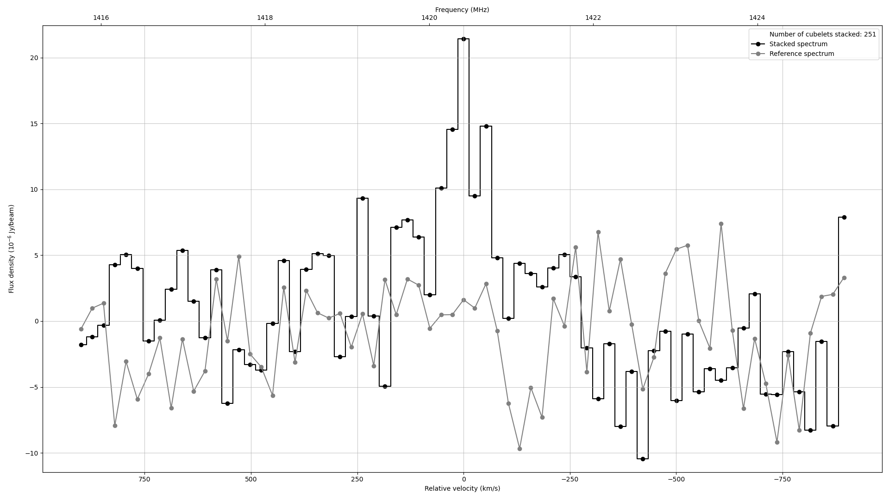

# Stacking-HI-datacube 
## Introduction
DOLORES extracts cubelets of galaxies in a datacube using a catalog and stack them over a referenced emission line to get a stacked datacube.
Results include the data, PSF and noise-reference datacubes, as well as the spectrum of the spaxel where the stacked emission lies.

## Dependencies
This package has a couple of Python dependencies:
* Astropy
* Maptplotlib
* Numpy
* SciPy
* Random
* Alive_progress
* Photutils
* Specutils
* OS
* CSV

If any of the above packages are missing, you can use:

  `sudo pip install <package name>`

Note: this package has been developed and tested on a computer running Ubuntu 20.04 and above using Python 3.9.13.

## Usage

## Results
The outputs created by the software:
  1. results_catalogue.csv:  A table containing the catalogue information of each galaxy and the integrated flux of their respective cubelet.
  2. data_stacked_cube.fits: The file containing the stacked data datacube.
  3. noise_stacked_cube.fits: The file containing the stacked datacube of reference.
  4. PSF_stacked_cube.fits: The file containing the stacked PSF datacube.
  5. data_stacked_cube.fits: The file containing the stacked datacube.
  6. spectrum_plot.pdf: A plot of the stacked central emission and reference spectrum along with any fitted functions.
 
