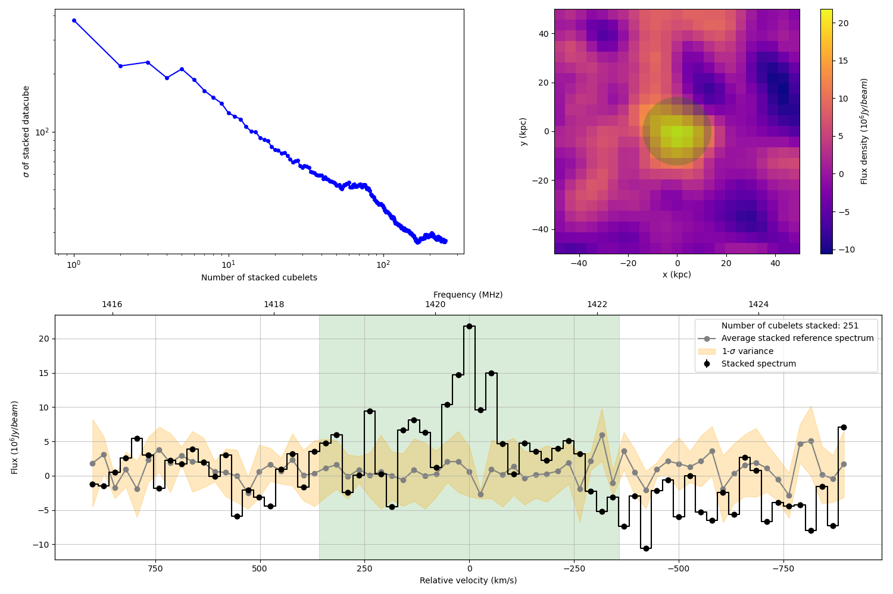

# Datacube ANalysis for Enhanced Emission Line stacking (DANEEL)
## Introduction
DANEEL extracts cubelets of galaxies in a datacube using a catalog and stack them over a referenced emission line to get a stacked datacube.
Results include the data, PSF and noise-reference datacubes, as well as the spectrum of the spaxel where the stacked emission lies.



## Dependencies
This package has a couple of Python dependencies:
* Astropy
* Maptplotlib
* Numpy
* SciPy
* Random
* Alive_progress
* Photutils
* Specutils
* OS
* CSV

If any of the above packages are missing, you can use:

  `sudo pip install <package name>`

Note: this software has been developed and tested on a computer running Ubuntu 20.04 and above using Python 3.9.13.

## Usage
DANEEL uses an input parameter file, which has the following format:

```
# Input parameters for DANEEL
PATH_FILES=
DATA_DATACUBE=fullsurvey_1255~1285_image.fits
PSF_DATACUBE=fullsurvey_1255_1285_psf.fits
CATALOG=G10COSMOSCatv05.csv_z051_sq_chiles_specz
COLUMN_RA=RA_08
COLUMN_DEC=DEC_08
COLUMN_Z=Z_BEST
PATH_RESULTS=Results/
WEIGHTS=fabello
DEGREE_FIT_CONTINUUM=1
CALCULATE_SNR=False
WIDTH_CUBELETS_KPC=80
WIDTH_CUBELETS_KMS=2000
```
The description of the parameters are the following:

* `PATH_FILES`: path of the directory where the datacubes are to be found,
* `DATA_DATACUBE`: name of the data datacube (with extension),
* `PSF_DATACUBE`: name of the PSF datacube (with extension),
* `CATALOG`: name of the datacube (with extension),
* `COLUMN_RA`: name of the column in the catalog of the right ascencion of the galaxies (in deg),
* `COLUMN_DEC`: name of the column in the catalog of the declination of the galaxies (in deg),
* `COLUMN_Z`: name of the column in the catalog of the redshift of the galaxies,
* `PATH_RESULTS`: path of the directory where the results are to be saved,
* `WEIGHTS`: method used for the weights applied during the stacking ('fabello', 'lah', 'delhaize' or None),
* `DEGREE_FIT_CONTINUUM`: degree of the polynomial fit made in order to fit the continuum of the spectra,
* `CALCULATE_SNR`: True in order to calculate the SNR of the central spectrum of the datacubes,
* `WIDTH_CUBELETS_KPC`: spatial length in kpc of the extracted cubelets centered on the galaxies,
* `WIDTH_CUBELETS_KMS`: spectral length in km/s of the extracted cubelets centered on the galaxies.

The file has to be saved in the same directory as the 'main.py' program, and has to be called 'param_file.txt'.

Steps:
  1. Download `main.py` and the folder `modules/`.
  2. Create a parameter file called `param_file.txt`.
  3. Execute `main.py`.
  4. With a bit of luck you should see the results in the `PATH_RESULTS` folder.

## Results
The outputs created by the software:
  1. results_catalogue.csv:  A table containing the catalogue information of each galaxy and the integrated flux of their respective cubelet.
  2. data_stacked_cube.fits: The file containing the stacked data datacube.
  3. noise_stacked_cube.fits: The file containing the stacked datacube of reference.
  4. PSF_stacked_cube.fits: The file containing the stacked PSF datacube.
  5. data_stacked_cube.fits: The file containing the stacked datacube.
  6. spectrum_plot.pdf: A plot of the stacked central emission and reference spectrum along with any fitted functions.
 
